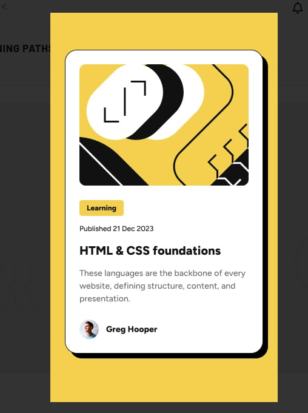
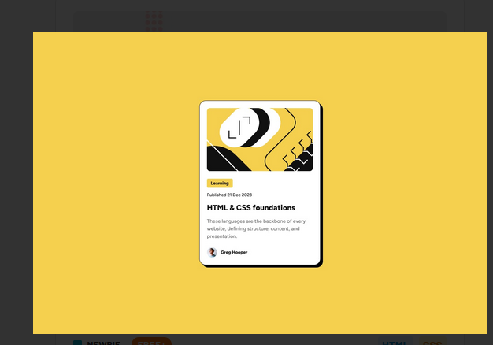

# Frontend Mentor - Product preview card component solution

## Table of contents

- [Overview](#overview)
  - [Screenshot](#screenshot)
  - [Links](#links)
- [My process](#my-process)
  - [Built with](#built-with)
  - [What I learned](#what-i-learned)
  - [Continued development](#continued-development)
  - [AI Collaboration](#ai-collaboration)
- [Author](#author)

## Overview

### Screenshot

### Links

- Solution URL: [GitHub Repository](https://github.com/akissi22/blog-preview-card)
- Live Site URL: [Add your GitHub Pages URL here]

## My process

### Built with

- Semantic HTML5
- CSS custom properties (variables)
- Flexbox
- Mobile-first workflow
- Responsive images with `<picture>`

### What I learned

Using the `clamp()` property for responsive typography helped me
better understand its structure and how viewport units work, which was unclear to me before. I also learned that media queries are not always necessary to adjust font sizes.

### Continued development

I want to continue exploring other CSS units like `em` and `%` and understand in which context to use them.

### AI Collaboration

I used Claude as a learning mentor throughout this challenge.
It guided me through problems with hints and questions rather
than giving direct answers, which helped me truly understand
each concept.

## Author

- Frontend Mentor - [@akissi22](https://www.frontendmentor.io/profile/akissi22)
